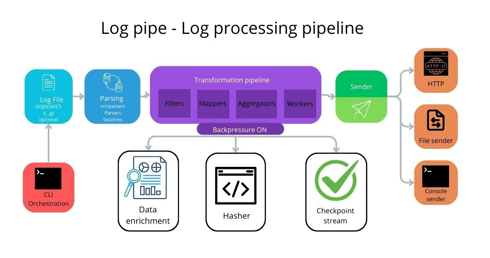

# LogPipe

LogPipe is a command-line tool for efficient processing of large log files, with support for transformations, filtering, and sending data to HTTP endpoints.



## Features

- Processing of large files with efficient memory usage using streams
- Support for multiple input formats (NDJSON, CSV)
- Data transformations (filter, mapping, aggregation)
- Parallel processing with worker threads
- Batch sending of data to HTTP endpoints
- Robust error handling and retries
- Real-time progress monitoring

## Installation

```bash
# Clone the repository
git clone https://github.com/your-username/logpipe.git
cd logpipe

# Install dependencies
npm install

# Make the command executable
npm link
```

## Basic Usage

```bash
# Process a NDJSON file and display to standard output
logpipe -i file.json

# Process a CSV file and save to an output file
logpipe -i file.csv -o output.json --format csv

# Filter records by field
logpipe -i file.json --filter "level:error"

# Select only specific fields
logpipe -i file.json --select "timestamp,message,level"

# Count records by field
logpipe -i file.json --count-by "level"

# Calculate statistics for a numeric field
logpipe -i file.json --stats "level:responseTime"
```

## Parallel Processing

LogPipe supports parallel processing using worker threads to improve performance in CPU-intensive tasks:

```bash
# Use parallel processing with the default number of workers (equal to the number of CPUs)
logpipe -i file.json --parallel

# Specify the number of workers
logpipe -i file.json --parallel -w 4

# Calculate hash for a field (always uses workers as it's CPU intensive)
logpipe -i file.json --hash-field "id"
```

## Checkpoints and Processing Resume

LogPipe can save progress periodically and resume processing from the last point in case of interruption:

```bash
# Enable checkpoints
logpipe -i file.json -c checkpoint.json

# Specify checkpoint saving interval (in ms)
logpipe -i file.json -c checkpoint.json --checkpoint-interval 60000

# Resume processing from an existing checkpoint
# (use the same command that was interrupted)
logpipe -i file.json -c checkpoint.json
```

When processing is interrupted (for example, with Ctrl+C), LogPipe saves the current state in a checkpoint file. On the next execution, it automatically detects that it should resume processing from the last saved point.

## Performance Analysis (Profiling)

LogPipe includes profiling tools to analyze processing performance:

```bash
# Enable profiling
logpipe -i file.json -p

# Specify directory for profiling reports
logpipe -i file.json -p --profile-dir "./profiling-reports"

# Specify metrics collection interval (in ms)
logpipe -i file.json -p --profile-interval 10000
```

The profiler collects metrics on:
- CPU usage
- Memory usage
- Garbage collection events
- Execution time of each processing step

Reports are saved as JSON files in the profiling directory and include both detailed data and a summary of the collected metrics.

## HTTP Endpoint Delivery

LogPipe can send processed data to an HTTP endpoint in batches:

```bash
# Send data to an HTTP endpoint
logpipe -i file.json --http-endpoint "http://localhost:3000/logs"

# Specify HTTP method (default: POST)
logpipe -i file.json --http-endpoint "http://localhost:3000/logs" --http-method "PUT"

# Configure batch size (default: 100)
logpipe -i file.json --http-endpoint "http://localhost:3000/logs" --http-batch-size 50

# Configure retries and timeout
logpipe -i file.json --http-endpoint "http://localhost:3000/logs" --http-retries 5 --http-timeout 60000

# Add custom HTTP headers
logpipe -i file.json --http-endpoint "http://localhost:3000/logs" --http-headers '{"Authorization": "Bearer token123"}'
```

## Test Server

The project includes a test HTTP server to facilitate development and testing:

```bash
# Start the test server
node src/test/testServer.js

# In another terminal, send data to the server
logpipe -i file.json --http-endpoint "http://localhost:3000/logs"
```

The test server saves received batches as JSON files in the `test-output/` directory for inspection.

## Complete Options

```
Options:
  -V, --version                output the version number
  -i, --input <path>           Input log file path
  -o, --output <path>          Output log file path
  -f, --format <format>        File format (ndjson, csv) (default: "ndjson")
  -b, --batch-size <size>      Batch size for processing (default: "1000")
  -w, --workers <count>        Number of worker processes (default: number of CPUs)
  -p, --profile                Enable performance profiling
  -c, --checkpoint <path>      Checkpoint file to resume processing
  --csv-separator <char>       CSV separator character (default: ",")
  --csv-header <boolean>       CSV has header row (default: true)
  --filter <field:value>       Filter records by field value
  --select <fields>            Select only specified fields (comma-separated)
  --count-by <field>           Count records by field
  --stats <keyField:valueField> Calculate statistics for numeric field grouped by key
  --pretty-output              Format JSON output with indentation (default: false)
  --parallel                   Use worker threads for parallel processing (default: false)
  --hash-field <field>         Calculate hash for specified field (CPU intensive)
  --enrich                     Add processing metadata to records (default: false)
  --http-endpoint <url>        HTTP endpoint URL to send data to
  --http-method <method>       HTTP method (POST, PUT) (default: "POST")
  --http-batch-size <size>     Number of records to send in each HTTP request (default: "100")
  --http-retries <count>       Number of retries for failed HTTP requests (default: "3")
  --http-timeout <ms>          HTTP request timeout in milliseconds (default: "30000")
  --http-headers <headers>     HTTP headers in JSON format
  -h, --help                   display help for command
```

## Advanced Usage Examples

### Complete ETL Pipeline

```bash
# Extract data from a CSV file, transform and send to an HTTP endpoint
logpipe -i logs.csv --format csv \
  --filter "status:error" \
  --select "timestamp,message,errorCode,userId" \
  --enrich \
  --http-endpoint "https://api.example.com/logs" \
  --http-headers '{"X-API-Key": "your-api-key"}'
```

### Log Analysis with Aggregation

```bash
# Count errors by error code and save to a file
logpipe -i logs.json \
  --filter "level:error" \
  --count-by "errorCode" \
  --pretty-output \
  -o error-summary.json
```

### Processing Large Files with Parallelism

```bash
# Process a large file with worker threads and send to HTTP
logpipe -i huge-logs.json \
  --parallel \
  -w 8 \
  --batch-size 5000 \
  --http-endpoint "http://localhost:3000/logs" \
  --http-batch-size 200
```

## License

MIT